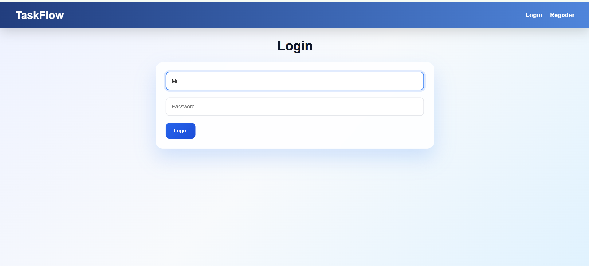
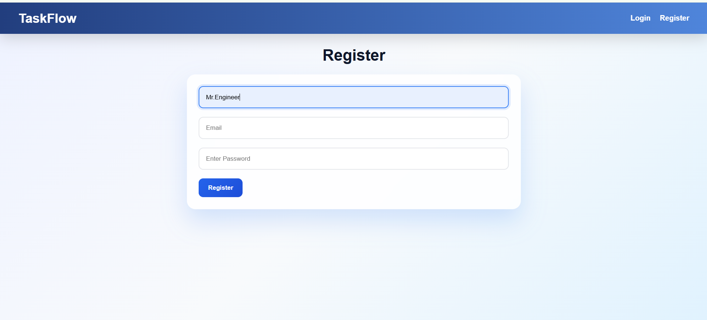
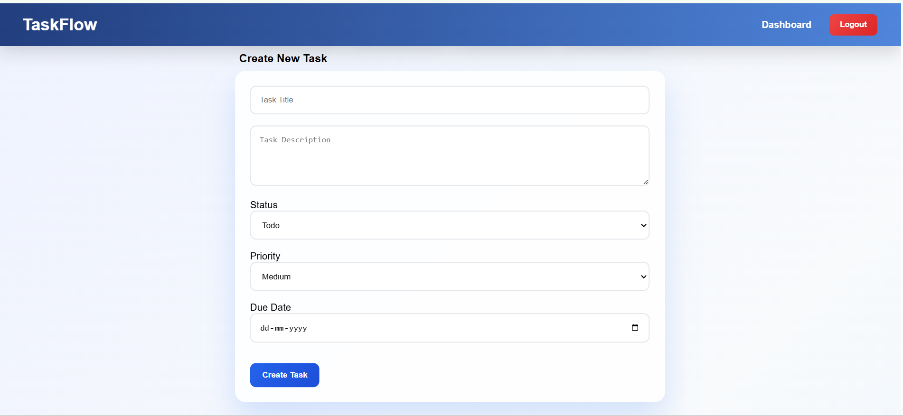
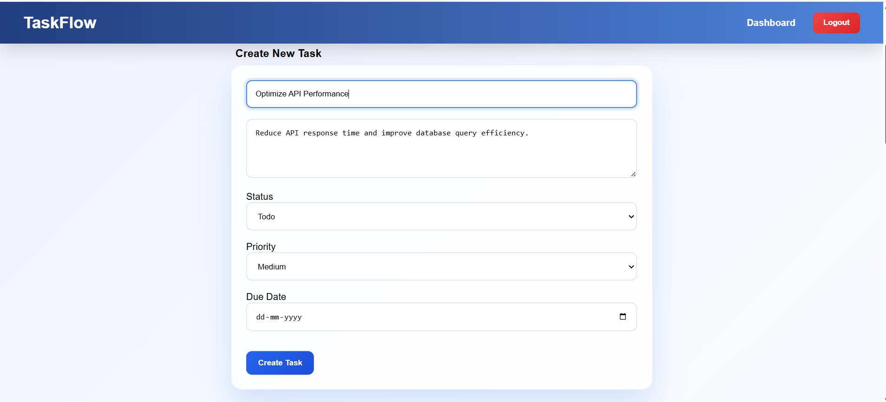
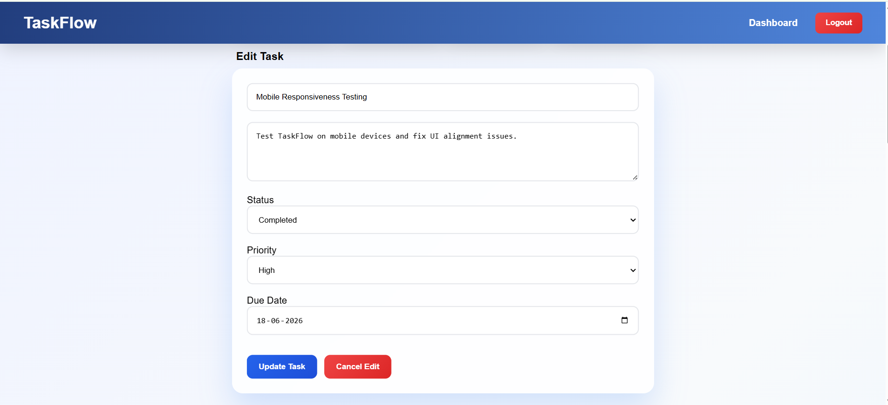
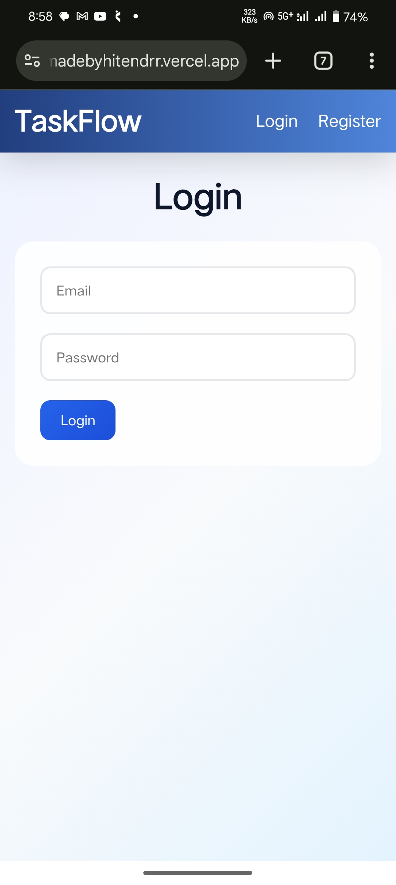
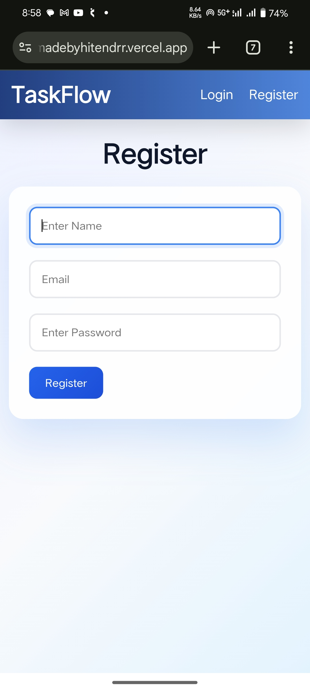

# 🚀 TaskFlow - MERN Stack Task Management Application

TaskFlow is a full-stack task management web application built using the MERN Stack (MongoDB, Express.js, React.js, Node.js). The application allows users to efficiently manage daily tasks through authentication, task tracking, priority management, due dates, and real-time search functionality.

Designed as an internship project, TaskFlow demonstrates full-stack development concepts including REST APIs, JWT Authentication, CRUD Operations, Protected Routes, MongoDB Integration, and Cloud Deployment.

---

## 🌐 Live Demo

### Frontend
https://task-flow-madebyhitendrr.vercel.app

### Backend API
https://taskflow-1-e08k.onrender.com

### GitHub Repository
https://github.com/Hitendrr-1/TaskFlow

### GitHub Profile
https://github.com/Hitendrr-1

---

## ✨ Features

### 🔐 Authentication & Security
- User Registration
- User Login
- JWT Authentication
- Protected Routes
- Password Hashing using Bcrypt.js
- User-specific Task Access

### 📋 Task Management
- Create New Tasks
- Read All Tasks
- Update Existing Tasks
- Delete Tasks
- Manage Task Status

### 🎯 Task Organization
- Priority Levels (Low, Medium, High)
- Task Status Tracking
  - Todo
  - In Progress
  - Completed
- Due Date Management
- Dashboard Statistics

### 🔍 Search Functionality
- Real-time Task Search
- Search Tasks by Title
- Dynamic Task Filtering

### 📊 Dashboard Overview
- Total Tasks Count
- Todo Tasks Count
- In Progress Tasks Count
- Completed Tasks Count

---

## 🛠️ Tech Stack

### Frontend
- React.js
- Vite
- Axios
- React Router DOM
- CSS3

### Backend
- Node.js
- Express.js
- MongoDB
- Mongoose
- JWT (JSON Web Token)
- Bcrypt.js

### Database
- MongoDB Atlas

### Deployment
- Frontend: Vercel
- Backend: Render

---

## 📂 Project Structure

```bash
TaskFlow/
│
├── backend/
│   ├── src/
│   │   ├── config/
│   │   ├── controllers/
│   │   ├── middleware/
│   │   ├── models/
│   │   └── routes/
│   │
│   ├── package.json
│   └── server.js
│
├── frontend/
│   ├── src/
│   │   ├── components/
│   │   ├── context/
│   │   ├── pages/
│   │   └── services/
│   │
│   ├── package.json
│   └── vite.config.js
│
└── README.md
```

---

## 🚀 Key Functionalities

### User Authentication

Users can:

- Register a new account
- Login securely
- Access protected routes
- Maintain authenticated sessions using JWT tokens

### Task Management

Users can:

- Create tasks
- Edit tasks
- Delete tasks
- Set priority levels
- Set due dates
- Update task status

### Dashboard Analytics

Users can instantly view:

- Total Tasks
- Pending Tasks
- Tasks In Progress
- Completed Tasks

---

## 🔑 API Endpoints

### Authentication Routes

```http
POST /api/auth/register
POST /api/auth/login
```

### Task Routes

```http
GET    /api/tasks
POST   /api/tasks
PUT    /api/tasks/:id
DELETE /api/tasks/:id
```

---

## ⚙️ Installation & Setup

### Clone Repository

```bash
git clone https://github.com/Hitendrr-1/TaskFlow.git
```

```bash
cd TaskFlow
```

---

## Backend Setup

```bash
cd backend
```

Install Dependencies

```bash
npm install
```

Create `.env` File

```env
MONGO_URI=your_mongodb_connection_string
JWT_SECRET=your_secret_key
PORT=5000
```

Run Backend

```bash
npm run dev
```

---

## Frontend Setup

```bash
cd frontend
```

Install Dependencies

```bash
npm install
```

Run Frontend

```bash
npm run dev
```

---

## 📸 Screenshots

















### Dashboard

- Task Statistics
- Task Creation Form
- Search Functionality
- Task Cards

(Add screenshots here for a more professional GitHub repository.)

---

## 🎯 Learning Outcomes

This project helped me gain practical experience in:

- Full Stack Web Development
- REST API Development
- JWT Authentication
- MongoDB Atlas Integration
- CRUD Operations
- React State Management
- Protected Routing
- Backend Deployment using Render
- Frontend Deployment using Vercel
- Git & GitHub Workflow

---

## 🚀 Future Improvements

Planned enhancements include:

- Dark Mode
- Task Categories
- Drag & Drop Task Board
- Task Sorting
- Advanced Filters
- Profile Management
- Team Collaboration
- Email Notifications
- Activity Logs

---

## 👨‍💻 Author

### Hitendra Jatav

B.Tech Computer Science Engineering

#### LinkedIn
https://www.linkedin.com/in/hitendrr

#### GitHub
https://github.com/Hitendrr-1

#### Project Repository
https://github.com/Hitendrr-1/TaskFlow

---

## ⭐ Support

If you found this project helpful, consider giving it a ⭐ on GitHub.

---

### Built with ❤️ using MERN Stack